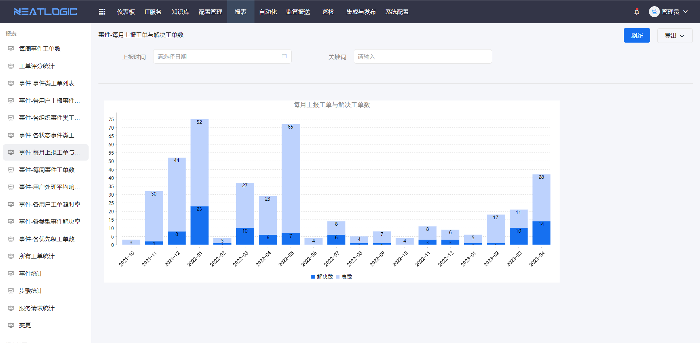
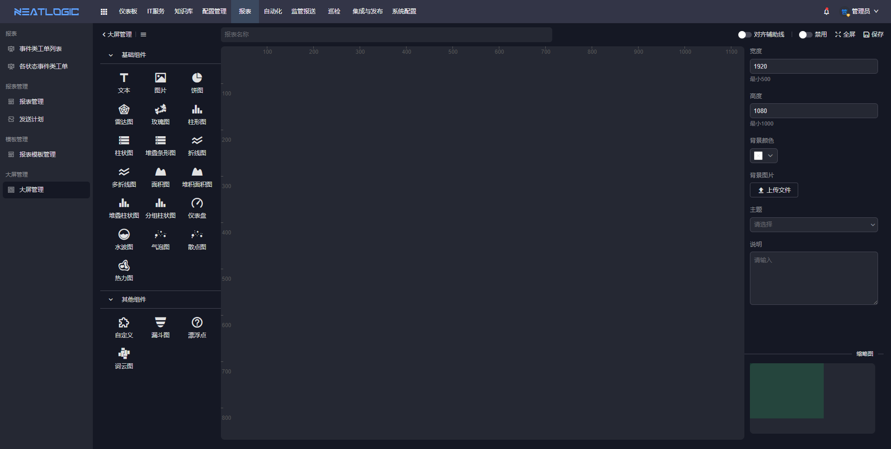
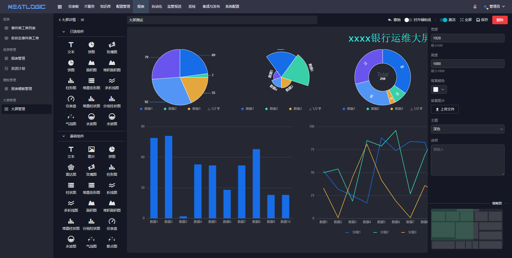

中文 / [English](README.en.md)

## 关于

neatlogic-report是报表模块，支持用户根据需求场景配置报表数据源和过滤条件，如用报表汇总最近一个月的所有工单，模块自带报表模板、报表管理、发送计划、大屏管理等功能。

## 主要功能

### 报表模板

报表模板是由条件配置、数据源配置和内容配置组成的，内容配置中可定义数据源展示的样式，如使用表格、柱状图、饼图等。报表模板为复用频率高的场景提供了便利，支持通过授权限制使用人员范围。

### 报表管理

报表管理是在引用报表模板基础上，根据需求配置过滤条件，支持通过授权控制报表可见人员范围。

报表菜单列表中展示当前登录人可查看的所有报表，点击标题可查看报表详情，报表展示如下图。

### 发送计划

发送计划支持配置定时器，把报表内容定期发送邮件到收件人。

### 大屏管理
大屏可以解决用户对数据实时监控和决策、宣传和展示的场景需求，大屏的特点有样式丰富多样、数据源自由度高、数据实时更新、可视化组件类型多等。大屏编辑页面分成三个区域：画布区、组件选择区、配置区。

- 画布区：即中间的核心编辑页面，支持移动组件位置，支持修改组件图层。
  
- 组件选择区：即饼图、折线图、柱形图等一系列的可视化图表选择。
- 配置区：当选中画布中的组件，右侧图层呈现组件的编辑配置，未选中组件，右侧呈现的是话不的编辑配置。数据配置的数据源来自系统配置模块的数据仓库。

