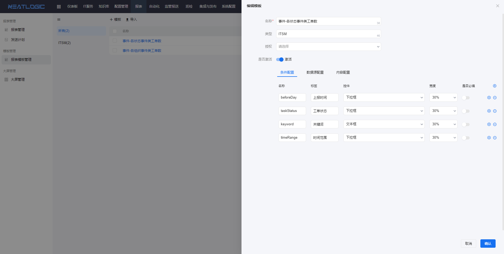
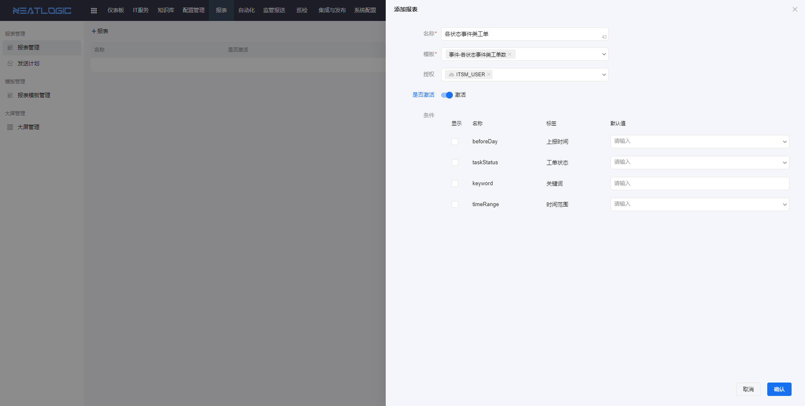
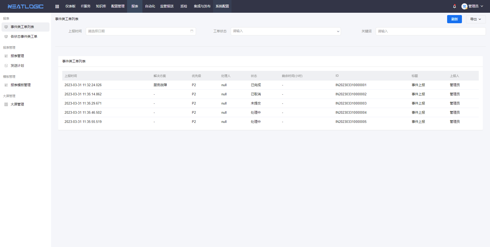
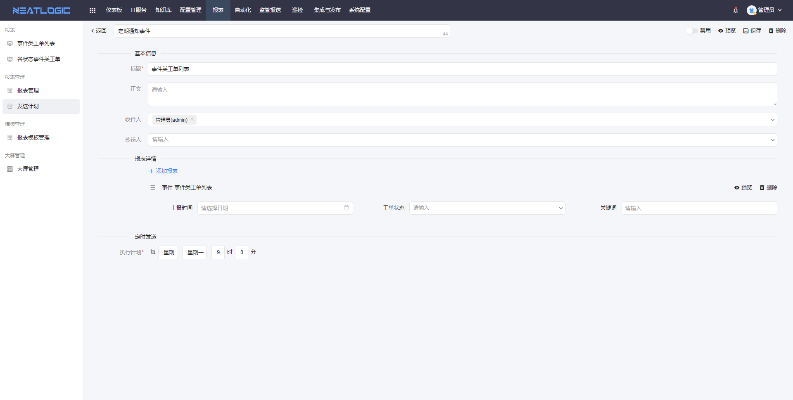

中文 / [English](README.en.md)

## 关于

neatlogic-report是报表模块，支持用户根据需求场景配置报表数据源和过滤条件，如用报表汇总最近一个月的所有工单，模块自带报表模板、报表管理、发送计划等功能。

## 主要功能

### 报表模板

报表模板是由条件配置、数据源配置和内容配置组成，授权给使用对象。

### 报表管理

报表管理是在引用报表模板基础上，根据需求配置过滤条件。

激活的报表展示在授权用户的导航列表中，点击标题可查看报表详情。

### 发送计划

发送计划支持配置定时器，把报表内容定期发送邮件到收件人。
